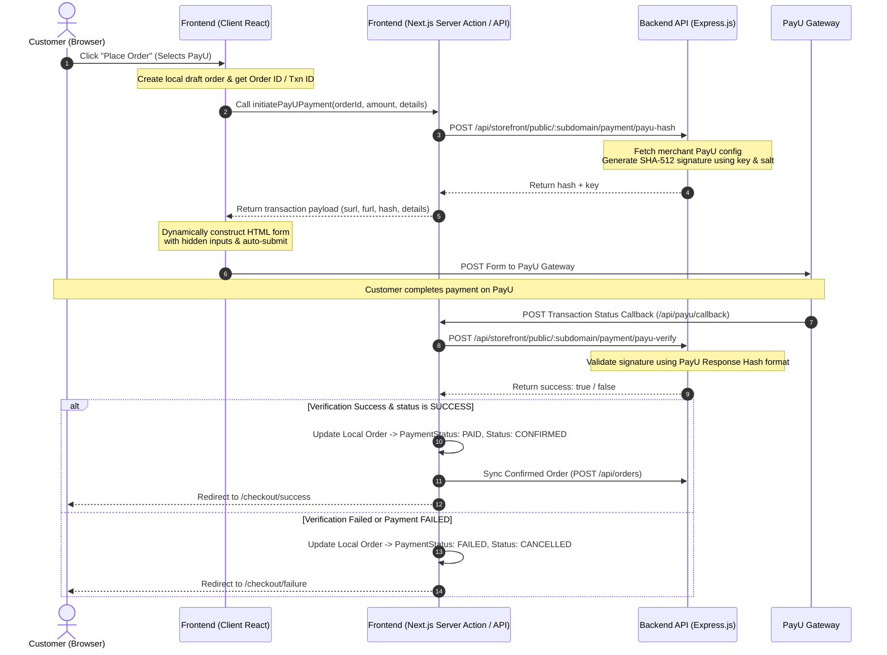

# PayU Payment Integration: Architecture & Replication Guide

This guide details the architecture, request flows, and code snippets from the codebase for the **PayU Hosted Checkout** integration. Use this document to replicate the exact flow and architecture in an existing system.

---

## 1. Architecture & Flow Overview

The payment integration utilizes a **hybrid client-server-backend** architecture to keep the sensitive client secrets (PayU Salt) secure on the backend while allowing a smooth hosted checkout redirect from the client.

### Payment Flow Diagram



---

## 2. Backend Implementation (Express.js)

The Express backend handles the cryptographic calculations to prevent exposing the client secret (Salt).

### Endpoints
- **POST** `/api/storefront/public/:subdomain/payment/payu-hash` — Generates PayU checkout parameters hash.
- **POST** `/api/storefront/public/:subdomain/payment/payu-verify` — Verifies the response hash returned by PayU.

---

### Hash Generation
**Controller Location:** [storefrontPublicController.js](file:///d:/Evoclabs/orbit_software/backend/src/controllers/storefrontPublicController.js#L1136-L1203)

#### Functionality
This function retrieves the store's PayU settings, decrypts the PayU client secret (Salt) if encrypted, concatenates fields using the pipe separator (`|`) in the specific sequence expected by PayU, and hashes it using SHA-512.

#### Code Snippet
```javascript
exports.generatePayUHash = async (req, res) => {
  try {
    const { subdomain } = req.params;
    const { txnid, amount, productinfo, firstname, email, phone } = req.body;

    const store = await prisma.store.findUnique({
      where: { subdomain },
      include: { paymentSettings: true }
    });

    if (!store) return res.status(404).json({ success: false, message: 'Store not found' });

    const payuConfig = store.paymentSettings;
    if (!payuConfig || !payuConfig.paymentsEnabled || !payuConfig.payNowEnabled) {
      return res.status(400).json({ success: false, message: 'PayU payment is not enabled for this store' });
    }

    const key = payuConfig.payuClientId;
    let salt = payuConfig.payuClientSecret;

    // Decrypt salt if encrypted
    if (salt && salt.includes(':')) {
      try {
        const { decrypt } = require('../utils/crypto');
        salt = decrypt(salt);
      } catch (e) {
        console.error('Failed to decrypt PayU salt:', e.message);
      }
    }

    if (!key || !salt) {
      return res.status(400).json({ success: false, message: 'PayU credentials are not configured' });
    }

    // PayU hash format: key|txnid|amount|productinfo|firstname|email|udf1|udf2|udf3|udf4|udf5|udf6|udf7|udf8|udf9|udf10|SALT
    const hashString = [
      key,
      txnid,
      String(amount),
      productinfo || '',
      firstname || '',
      email || '',
      req.body.udf1 || '', // udf1 (typically subdomain)
      req.body.udf2 || '', // udf2
      req.body.udf3 || '', // udf3
      req.body.udf4 || '', // udf4
      req.body.udf5 || '', // udf5
      req.body.udf6 || '', // udf6
      req.body.udf7 || '', // udf7
      req.body.udf8 || '', // udf8
      req.body.udf9 || '', // udf9
      req.body.udf10 || '', // udf10
      salt
    ].join('|');

    const crypto = require('crypto');
    const hash = crypto.createHash('sha512').update(hashString).digest('hex');

    res.json({
      success: true,
      hash,
      key
    });
  } catch (error) {
    console.error('Error generating PayU hash:', error);
    res.status(500).json({ success: false, message: 'Failed to generate PayU hash' });
  }
};
```

---

### Hash Verification
**Controller Location:** [storefrontPublicController.js](file:///d:/Evoclabs/orbit_software/backend/src/controllers/storefrontPublicController.js#L1205-L1284)

#### Functionality
Verifies the response returned from PayU. It constructs a string using the reversed response signature sequence required by PayU, hashes it with SHA-512, and compares it to the incoming hash.

> [!IMPORTANT]
> The PayU response hash sequence is different from the request hash sequence:
> `SALT|status|udf10|udf9|udf8|udf7|udf6|udf5|udf4|udf3|udf2|udf1|email|firstname|productinfo|amount|txnid|key`

#### Code Snippet
```javascript
exports.verifyPayUHash = async (req, res) => {
  try {
    const { subdomain } = req.params;
    const data = req.body;

    const store = await prisma.store.findUnique({
      where: { subdomain },
      include: { paymentSettings: true }
    });

    if (!store) return res.status(404).json({ success: false, message: 'Store not found' });

    const payuConfig = store.paymentSettings;
    if (!payuConfig) {
      return res.status(400).json({ success: false, message: 'PayU is not configured' });
    }

    let salt = payuConfig.payuClientSecret;
    if (salt && salt.includes(':')) {
      try {
        const { decrypt } = require('../utils/crypto');
        salt = decrypt(salt);
      } catch (e) {
        console.error('Failed to decrypt PayU salt:', e.message);
      }
    }

    if (!salt) {
      return res.status(400).json({ success: false, message: 'PayU salt is missing' });
    }

    const {
      key,
      txnid,
      amount,
      productinfo,
      firstname,
      email,
      status,
      hash,
      udf1,
      udf2,
    } = data;

    // PayU response hash sequence
    const verificationString = [
      salt,
      status,
      "", // udf10
      "", // udf9
      "", // udf8
      "", // udf7
      "", // udf6
      "", // udf5
      "", // udf4
      "", // udf3
      udf2 || "",
      udf1 || "",
      email,
      firstname,
      productinfo,
      amount,
      txnid,
      key,
    ].join("|");

    const crypto = require('crypto');
    const calculatedHash = crypto.createHash("sha512").update(verificationString).digest("hex");

    if (calculatedHash !== hash) {
      console.error("PayU verification: Hash mismatch!", { calculatedHash, receivedHash: hash });
      return res.json({ success: false, message: 'Hash mismatch' });
    }

    res.json({ success: true });
  } catch (error) {
    console.error('Error verifying PayU hash:', error);
    res.status(500).json({ success: false, message: 'Failed to verify PayU hash' });
  }
};
```

---

## 3. Frontend Implementation (Next.js App Router)

The frontend initiates the transaction request, handles the hosted checkout redirection, and provides an endpoint for the PayU server callback.

---

### Step A: Payment Initiation Server Action
**Location:** [payment-actions.ts](file:///d:/Evoclabs/orbit_software/store/src/actions/payment-actions.ts)

This server action prepares the transaction arguments, resolves URLs dynamically to support white-labeled domains or local subdomains, fetches the hashed checkout fields from the backend API, and formats the payment data payload for the client.

#### Code Snippet
```typescript
'use server';

import { headers } from 'next/headers';
import { PAYU_CALLBACK_URL } from '@/lib/env';
import { getServerSubdomain } from '@/lib/server-utils';

export async function initiatePayUPayment(data: {
  orderId: string;
  amount: number;
  firstName: string;
  email: string;
  phone: string;
  productinfo: string;
}) {
  try {
    const { orderId, amount, firstName, email, phone, productinfo } = data;
    // Derive txn id from order UUID's last 12 chars
    const txnid = orderId.slice(-12).toUpperCase();

    // Dynamically build the callback URL based on request headers to support multiple domains
    const headersList = await headers();
    let host = headersList.get('x-forwarded-host') || headersList.get('host') || '';
    if (host.includes(',')) {
      host = host.split(',')[0].trim();
    }
    const protocol = host.includes('localhost') || host.includes('127.0.0.1') ? 'http' : 'https';
    const callbackUrl = host ? `${protocol}://${host}/api/payu/callback` : PAYU_CALLBACK_URL;
    
    if (!callbackUrl) {
      return { success: false, message: 'PAYU_CALLBACK_URL is required' };
    }

    const subdomain = await getServerSubdomain();
    const apiBase = process.env.NEXT_PUBLIC_API_BASE || 'https://api.evoclabs.com/api/storefront/public';
    const hashUrl = `${apiBase}/${subdomain}/payment/payu-hash`;

    const res = await fetch(hashUrl, {
      method: 'POST',
      headers: { 'Content-Type': 'application/json' },
      body: JSON.stringify({
        txnid,
        amount: Number(amount.toFixed(2)),
        productinfo,
        firstname: firstName,
        email,
        phone,
        udf1: subdomain, // Pass subdomain in udf1 to assist callback route resolving
      }),
    });

    const hashData = await res.json();
    if (!hashData.success) {
      return { success: false, message: hashData.message || 'Failed to generate payment hash' };
    }

    return {
      success: true,
      data: {
        key: hashData.key,
        txnid,
        amount: amount.toFixed(2),
        productinfo,
        firstname: firstName,
        email,
        phone,
        hash: hashData.hash,
        surl: callbackUrl, // success redirect
        furl: callbackUrl, // failure redirect
        udf1: subdomain,
      },
    };
  } catch (error: any) {
    return { success: false, message: error.message };
  }
}
```

---

### Step B: Client-Side Redirect Form Submission
**Location:** [page.tsx](file:///d:/Evoclabs/orbit_software/store/src/app/checkout/page.tsx#L91-L122)

Once the client-side component retrieves the signed hash and configuration, it uses a React `useEffect` hook to programmatically create and submit an HTML `form` via standard POST method to redirect the customer to PayU Hosted Checkout.

#### React Code Snippet
```typescript
// Redirect to PayU Hosted Checkout (to avoid domain/CORS issues)
useEffect(() => {
  if (!payUData || !pendingOrderId) return;
  if (launchAttemptedRef.current) return;
  launchAttemptedRef.current = true;

  console.log('Redirecting to PayU Hosted Checkout...', payUData);

  const form = document.createElement('form');
  form.method = 'POST';

  // Set destination URL: PayU sandbox/test or production
  const isTestKey = payUData.key === 'IWqFlM' || process.env.NEXT_PUBLIC_PAYU_SANDBOX === 'true';
  form.action = isTestKey 
    ? 'https://test.payu.in/_payment' 
    : 'https://secure.payu.in/_payment';

  // Append fields as hidden inputs
  Object.entries(payUData).forEach(([key, val]) => {
    const input = document.createElement('input');
    input.type = 'hidden';
    input.name = key;
    input.value = String(val);
    form.appendChild(input);
  });

  document.body.appendChild(form);
  form.submit();

  // Clean up state
  setPayUData(null);
  launchAttemptedRef.current = false;
}, [payUData, pendingOrderId]);
```

---

### Step C: PayU Callback Router (Next.js API Route)
**Location:** [route.ts](file:///d:/Evoclabs/orbit_software/store/src/app/api/payu/callback/route.ts)

PayU hits this route via POST request with the transaction result form data. This function parses the form data, invokes the backend `/payu-verify` endpoint, updates the local database order status, performs backend synchronization, and finally issues a HTTP redirect.

#### Code Snippet
```typescript
import { NextRequest, NextResponse } from 'next/server';
import { prisma } from '@/lib/prisma';
import { confirmAndSyncPayUOrder } from '@/actions/order-actions';

export async function POST(request: NextRequest) {
  // Dynamically build the base URL based on headers to preserve correct protocol and host
  let host = request.headers.get('x-forwarded-host') || request.headers.get('host') || '';
  if (host.includes(',')) {
    host = host.split(',')[0].trim();
  }
  const protocol = host.includes('localhost') || host.includes('127.0.0.1') ? 'http' : 'https';
  const baseUrl = host ? `${protocol}://${host}` : new URL(request.url).origin;

  try {
    const body = await request.formData();
    const data: Record<string, string> = {};
    body.forEach((value, key) => {
      data[key] = value.toString();
    });

    const {
      key,
      txnid,
      amount,
      productinfo,
      firstname,
      lastname,
      email,
      status,
      mihpayid,
      hash,
      udf1,
      udf2,
    } = data;

    // Resolve subdomain: check udf1 (set during payment initiation) first
    let subdomain = udf1 || request.headers.get('x-subdomain') || '';
    if (!subdomain) {
      let host = request.headers.get('x-forwarded-host') || request.headers.get('host') || '';
      if (host.includes(',')) {
        host = host.split(',')[0].trim();
      }
      if (host) {
        const hostname = host.split(':')[0];
        if (hostname === 'localhost' || hostname === '127.0.0.1') {
          subdomain = process.env.NEXT_PUBLIC_SUBDOMAIN || '';
        } else {
          const parts = hostname.split('.');
          if (parts.length >= 2) {
            subdomain = parts[0];
          }
        }
      }
    }
    if (!subdomain) {
      subdomain = process.env.NEXT_PUBLIC_SUBDOMAIN || '';
    }

    const apiBase = process.env.NEXT_PUBLIC_API_BASE || 'https://api.evoclabs.com/api/storefront/public';
    const verifyUrl = `${apiBase}/${subdomain}/payment/payu-verify`;

    // 1. Verify payment parameters match cryptographic hash
    const verifyRes = await fetch(verifyUrl, {
      method: 'POST',
      headers: { 'Content-Type': 'application/json' },
      body: JSON.stringify(data),
    });

    const verifyResult = await verifyRes.json();
    if (!verifyResult.success) {
      console.error("PayU callback: Hash verification failed on backend!");
      return NextResponse.redirect(new URL(`/checkout/failure?reason=hash_mismatch`, baseUrl));
    }

    // Validate status value to prevent enum confusion
    const normalizedStatus = status?.toLowerCase();
    if (normalizedStatus !== 'success' && normalizedStatus !== 'failure') {
      console.error("PayU callback: Invalid status value:", status);
      return NextResponse.redirect(new URL(`/checkout/failure?reason=invalid_status`, baseUrl));
    }

    const isSuccess = normalizedStatus === 'success';

    // Find local order - PayU txnid is derived from order UUID's last 12 chars
    const order = await prisma.order.findFirst({
      where: {
        OR: [
          { payuTxnId: txnid },
          { id: { endsWith: txnid } },
        ],
      },
      orderBy: { createdAt: 'desc' },
    });

    if (!order) {
      console.warn(`PayU callback: Order ${txnid} not found`);
      return NextResponse.redirect(new URL(`/checkout/failure?reason=order_not_found`, baseUrl));
    }

    // Update shipping address customer name details
    const shippingAddress = order.shippingAddress as any;
    const updatedShippingAddress = {
      ...shippingAddress,
      firstName: firstname || shippingAddress.firstName,
      lastName: lastname || shippingAddress.lastName,
    };

    if (isSuccess) {
      // 2. Mark local order paid and sync with external backend API
      await confirmAndSyncPayUOrder(order.id, mihpayid || txnid, status, data);
      
      // Update shipping details locally (confirmAndSyncPayUOrder handles status/paymentStatus)
      await prisma.order.update({
        where: { id: order.id },
        data: {
          shippingAddress: updatedShippingAddress,
          customerEmail: email || order.customerEmail,
        },
      });
    } else {
      // 3. Mark local order as failed
      await prisma.order.update({
        where: { id: order.id },
        data: {
          shippingAddress: updatedShippingAddress,
          customerEmail: email || order.customerEmail,
          paymentStatus: "FAILED",
          status: "CANCELLED",
          payuTxnId: mihpayid || order.payuTxnId,
          payuStatus: status,
          payuResponse: data,
        },
      });
    }

    console.log(`PayU callback: Order ${order.id} processed status: ${status}`);

    // Redirect based on payment status
    if (isSuccess) {
      return NextResponse.redirect(new URL(`/checkout/success?orderId=${order.id}&txn=${mihpayid}`, baseUrl));
    } else {
      return NextResponse.redirect(new URL(`/checkout/failure?reason=${status}`, baseUrl));
    }
  } catch (error) {
    console.error("PayU callback error:", error);
    return NextResponse.redirect(new URL(`/checkout/failure?reason=error`, baseUrl));
  }
}
```

---

### Step D: Order Synchronization Helper
**Location:** [order-actions.ts](file:///d:/Evoclabs/orbit_software/store/src/actions/order-actions.ts#L439-L540)

Called after a successful payment callback, this function marks the local order as paid/confirmed, and posts the full payload to the main Order system REST API (in a multi-service or distributed deployment).

#### Code Snippet
```typescript
export async function confirmAndSyncPayUOrder(orderId: string, txnId: string, payuStatus?: string, payuResponse?: any) {
  try {
    const order = await prisma.order.findUnique({
      where: { id: orderId },
      include: { items: true },
    });

    if (!order) {
      return { success: false, message: 'Order not found' };
    }

    if (order.paymentStatus === 'PAID') {
      console.log(`[Sync] Order ${orderId} already marked PAID. Skipping backend sync.`);
      return { success: true, data: order };
    }

    console.log(`[Sync] Confirming and syncing Order ${orderId} to backend...`);

    // 1. Update local order status
    const updatedOrder = await prisma.order.update({
      where: { id: orderId },
      data: {
        paymentStatus: 'PAID',
        status: 'CONFIRMED',
        payuTxnId: txnId || undefined,
        ...(payuStatus && { payuStatus }),
        ...(payuResponse && { payuResponse: payuResponse as any }),
      },
      include: { items: true },
    });

    const apiBase = process.env.NEXT_PUBLIC_API_BASE || 'https://api.evoclabs.com/api/storefront/public';
    // Translate base URL to target backend orders sync endpoint
    const ordersApiUrl = apiBase.replace('/storefront/public', '/orders');

    const externalPayload = {
      storeId: order.storeId,
      userId: order.userId,
      orderNumber: order.orderNumber,
      customerName: order.customerName,
      customerEmail: order.customerEmail,
      shippingAddress: {
        firstName: (order.shippingAddress as any).firstName || '',
        lastName: (order.shippingAddress as any).lastName || '',
        line1: (order.shippingAddress as any).street || '',
        addressLine1: (order.shippingAddress as any).street || '',
        city: (order.shippingAddress as any).city || '',
        state: (order.shippingAddress as any).state || '',
        zip: (order.shippingAddress as any).zipCode || '',
        postalCode: (order.shippingAddress as any).zipCode || '',
        zipCode: (order.shippingAddress as any).zipCode || '',
        country: 'IN',
        phone: (order.shippingAddress as any).phone || '',
      },
      billingAddress: {
        firstName: (order.billingAddress as any).firstName || '',
        lastName: (order.billingAddress as any).lastName || '',
        line1: (order.billingAddress as any).street || '',
        addressLine1: (order.billingAddress as any).street || '',
        city: (order.billingAddress as any).city || '',
        state: (order.billingAddress as any).state || '',
        zip: (order.billingAddress as any).zipCode || '',
        postalCode: (order.billingAddress as any).zipCode || '',
        zipCode: (order.billingAddress as any).zipCode || '',
        country: 'IN',
        phone: (order.billingAddress as any).phone || '',
      },
      subtotal: order.subtotal,
      total: order.total,
      shipping: order.shipping,
      tax: order.tax,
      source: 'STOREFRONT',
      paymentStatus: 'PAID',
      status: 'CONFIRMED',
      items: order.items.map((item: any) => ({
        productId: item.productId,
        name: item.name,
        quantity: item.quantity,
        price: Number(item.price),
        variantInfo: item.variantInfo || undefined,
      })),
    };

    const response = await fetch(ordersApiUrl, {
      method: 'POST',
      headers: { 'Content-Type': 'application/json' },
      body: JSON.stringify(externalPayload),
    });

    if (!response.ok) {
      const errorText = await response.text();
      console.warn(`[Sync] Failed to sync order to backend:`, errorText);
    } else {
      console.log(`[Sync] Order ${orderId} successfully synced to backend.`);
    }

    return { success: true, data: updatedOrder };
  } catch (error: any) {
    console.error('[confirmAndSyncPayUOrder] Error:', error);
    return { success: false, message: error.message };
  }
}
```

---

## 4. Portability Checklist

When copying this payment integration into a different website:

1. **Cryptographic Algorithm**: Ensure your destination language supports standard `SHA-512` hashing.
2. **Parameters Ordering**:
   - For **Initiation/Hash generation**, format standard: `key|txnid|amount|productinfo|firstname|email|udf1|udf2|udf3|udf4|udf5|udf6|udf7|udf8|udf9|udf10|SALT`
   - For **Callback/Verification**, format standard: `SALT|status|udf10|udf9|udf8|udf7|udf6|udf5|udf4|udf3|udf2|udf1|email|firstname|productinfo|amount|txnid|key`
3. **Environment Setup**:
   - `NEXT_PUBLIC_PAYU_SANDBOX` (Set `true` for staging/test environment)
   - Sandbox Gateway Endpoint: `https://test.payu.in/_payment`
   - Production Gateway Endpoint: `https://secure.payu.in/_payment`
4. **Transaction ID Match**: The transaction ID passed to PayU should match or map uniquely to your order identifier. In this repository, the transaction ID `txnid` is derived from the last 12 characters of the order's UUID.
5. **Session/Redirect Handling**: Ensure the callback handler URL (`surl` and `furl`) is accessible publicly so PayU's webhook can make a POST request to it.
6. **Subdomain Parameter**: If your site supports tenancy or multiple subdomains, pass the subdomain in the `udf1` field during initiation so that it can be correctly retrieved and resolved when PayU issues the callback.
